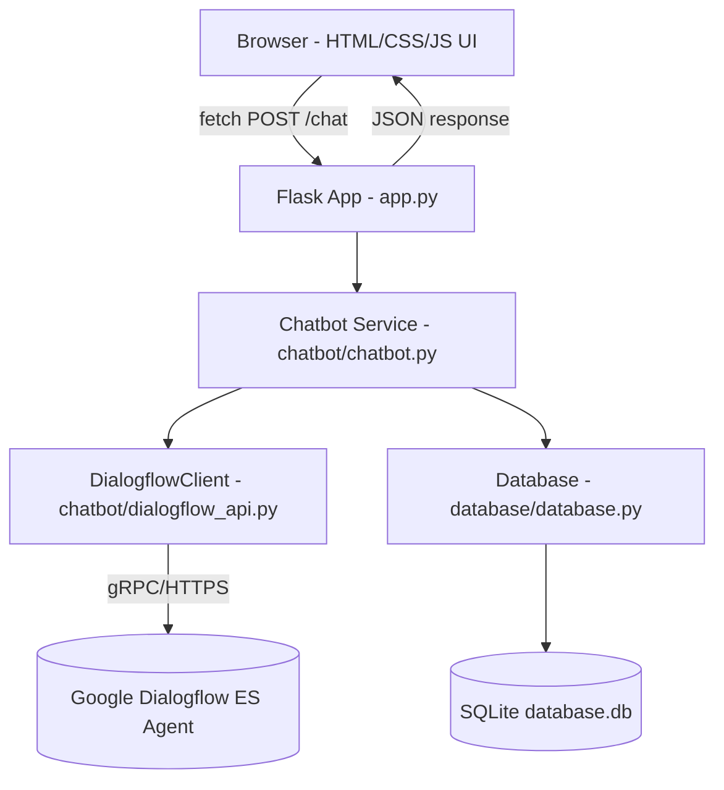
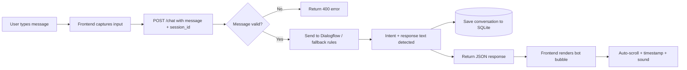
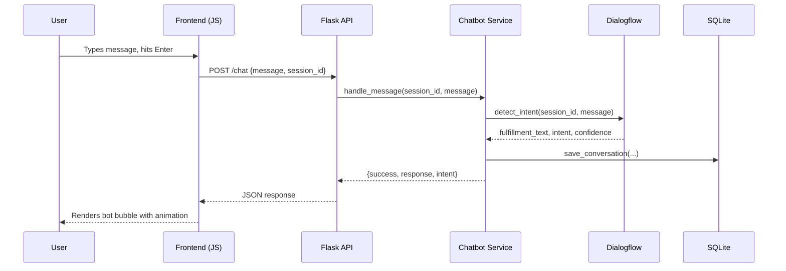
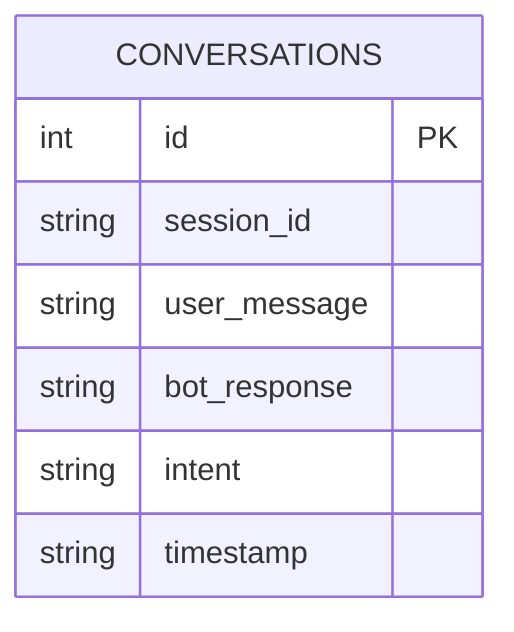

# 🤖 AI-Chatbot-Using-Dialogflow

A production-ready, full-stack AI chatbot web application built with **Flask**, **Google Dialogflow ES**, and **vanilla JavaScript**. Features a modern glassmorphism UI, dark/light mode, voice input, chat export, and persistent conversation history via SQLite.

> Runs out-of-the-box in **fallback mode** (simple rule-based replies) even without Dialogflow credentials configured, so you can try it immediately, then upgrade to full NLU once your Dialogflow agent is ready.

---

## 📋 Table of Contents

- [Features](#-features)
- [Tech Stack](#-tech-stack)
- [Architecture](#-architecture)
- [Data Flow Diagram](#-data-flow-diagram)
- [Sequence Diagram](#-sequence-diagram)
- [ER Diagram](#-er-diagram)
- [Folder Structure](#-folder-structure)
- [Installation](#-installation)
- [Setting Up Dialogflow ES](#-setting-up-dialogflow-es)
- [Setting Up Google Cloud Credentials](#-setting-up-google-cloud-credentials)
- [Running the Project](#-running-the-project)
- [API Documentation](#-api-documentation)
- [Git Commands](#-git-commands)
- [Screenshots](#-screenshots)
- [Deployment Guides](#-deployment-guides)
- [Future Improvements](#-future-improvements)
- [Interview Questions & Answers](#-common-interview-questions--answers)
- [License](#-license)

---

## ✨ Features

**UI/UX**
- Glassmorphism design with animated gradient accents
- Fully responsive (mobile, tablet, desktop)
- Dark mode / Light mode toggle
- Floating chat button with online indicator
- Animated bot & user typing indicators
- Auto-scroll to latest message with timestamps
- Emoji picker
- Character counter (500 char limit)

**Chatbot**
- Google Dialogflow ES integration for NLU
- Handles greetings, jokes, weather small talk, thanks, goodbye, and fallback intents
- Graceful **rule-based fallback mode** when Dialogflow isn't configured yet
- Voice input via Web Speech API
- Text-to-speech output via SpeechSynthesis (muted by default, toggle in code)
- Chat export as `.txt`
- Clear chat / persistent history per session (SQLite)
- Online/offline network indicator

**Backend**
- Flask REST API (`/chat`, `/history`, `/clear`, `/health`)
- Flask-CORS enabled
- Centralized structured logging (console + file)
- Full exception handling (empty messages, network failures, missing credentials, Dialogflow errors)
- SQLite auto-creates schema on first run

---

## 🛠 Tech Stack

| Layer      | Technology                              |
|------------|------------------------------------------|
| Backend    | Python 3.12, Flask, Flask-CORS           |
| NLU        | Google Dialogflow ES, Google Cloud SDK   |
| Frontend   | HTML5, CSS3, Vanilla JavaScript          |
| Database   | SQLite                                    |
| Fonts      | Google Fonts (Poppins, Inter)             |
| VCS        | Git / GitHub                              |

---

## 🏗 Architecture



**Layers**
1. **Presentation layer** — static HTML/CSS/JS served by Flask, communicates purely over JSON via `fetch()`.
2. **Application layer** — `app.py` handles HTTP routing, validation, and error responses.
3. **Service layer** — `chatbot/chatbot.py` orchestrates NLU + persistence, keeping routes thin.
4. **Integration layer** — `chatbot/dialogflow_api.py` isolates all Dialogflow SDK specifics (and provides a local fallback).
5. **Persistence layer** — `database/database.py` wraps SQLite for conversation storage.

---

## 🔄 Data Flow Diagram



---

## 🔁 Sequence Diagram



---

## 🗄 ER Diagram



A single-table schema is sufficient for this project's scope: each row represents one full turn (user message + bot reply) tied to a `session_id`, enabling per-session history retrieval and clearing.

---

## 📁 Folder Structure

```
AI-Chatbot-Using-Dialogflow/
│
├── app.py                       # Flask application & routes
├── config.py                    # Environment-driven configuration
├── requirements.txt             # Python dependencies
├── README.md                    # This file
├── .gitignore
│
├── templates/
│   └── index.html                # Chat UI markup
│
├── static/
│   ├── css/
│   │   └── style.css             # Glassmorphism styling, dark/light themes
│   ├── js/
│   │   └── script.js             # Frontend logic (fetch, voice, export, etc.)
│   └── images/
│       └── chatbot.png           # Bot icon
│
├── dialogflow/
│   └── credentials.example.json  # Template — copy to credentials.json
│
├── database/
│   ├── __init__.py
│   └── database.py               # SQLite persistence layer
│
├── chatbot/
│   ├── __init__.py
│   ├── dialogflow_api.py         # Dialogflow SDK wrapper + fallback rules
│   └── chatbot.py                # Business logic orchestration
│
└── screenshots/                  # App screenshots for documentation
```

> Note: `database.db` and `dialogflow/credentials.json` are intentionally **not** committed to version control (see `.gitignore`) since they contain runtime/generated data and secrets respectively. `database.db` is auto-created the first time you run the app.

## 📄 License

This project is licensed under the [MIT License](https://opensource.org/licenses/MIT) — free to use, modify, and distribute with attribution.

