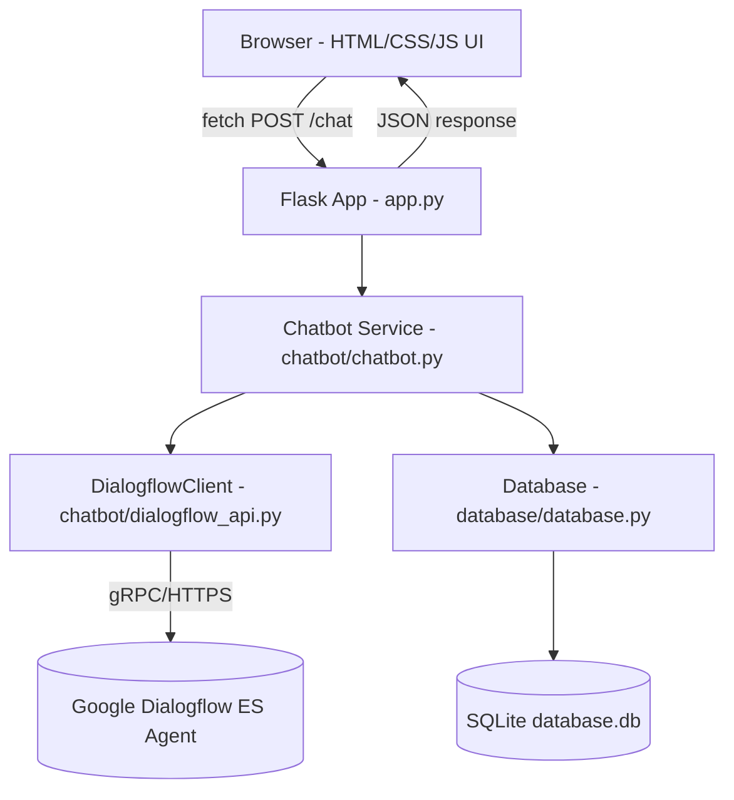
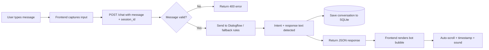
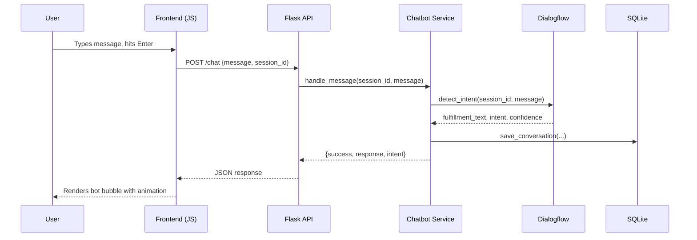
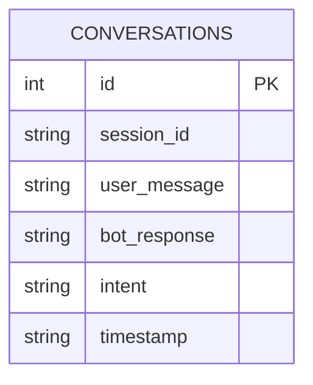

# 🤖 AI-Chatbot-Using-Dialogflow

A production-ready, full-stack AI chatbot web application built with **Flask**, **Google Dialogflow ES**, and **vanilla JavaScript**. Features a modern glassmorphism UI, dark/light mode, voice input, chat export, and persistent conversation history via SQLite.

> Runs out-of-the-box in **fallback mode** (simple rule-based replies) even without Dialogflow credentials configured, so you can try it immediately, then upgrade to full NLU once your Dialogflow agent is ready.

---

## 📋 Table of Contents

- [Features](#-features)
- [Tech Stack](#-tech-stack)
- [Architecture](#-architecture)
- [Data Flow Diagram](#-data-flow-diagram)
- [Sequence Diagram](#-sequence-diagram)
- [ER Diagram](#-er-diagram)
- [Folder Structure](#-folder-structure)
- [Installation](#-installation)
- [Setting Up Dialogflow ES](#-setting-up-dialogflow-es)
- [Setting Up Google Cloud Credentials](#-setting-up-google-cloud-credentials)
- [Running the Project](#-running-the-project)
- [API Documentation](#-api-documentation)
- [Git Commands](#-git-commands)
- [Screenshots](#-screenshots)
- [Deployment Guides](#-deployment-guides)
- [Future Improvements](#-future-improvements)
- [Interview Questions & Answers](#-common-interview-questions--answers)
- [License](#-license)

---

## ✨ Features

**UI/UX**
- Glassmorphism design with animated gradient accents
- Fully responsive (mobile, tablet, desktop)
- Dark mode / Light mode toggle
- Floating chat button with online indicator
- Animated bot & user typing indicators
- Auto-scroll to latest message with timestamps
- Emoji picker
- Character counter (500 char limit)

**Chatbot**
- Google Dialogflow ES integration for NLU
- Handles greetings, jokes, weather small talk, thanks, goodbye, and fallback intents
- Graceful **rule-based fallback mode** when Dialogflow isn't configured yet
- Voice input via Web Speech API
- Text-to-speech output via SpeechSynthesis (muted by default, toggle in code)
- Chat export as `.txt`
- Clear chat / persistent history per session (SQLite)
- Online/offline network indicator

**Backend**
- Flask REST API (`/chat`, `/history`, `/clear`, `/health`)
- Flask-CORS enabled
- Centralized structured logging (console + file)
- Full exception handling (empty messages, network failures, missing credentials, Dialogflow errors)
- SQLite auto-creates schema on first run

---

## 🛠 Tech Stack

| Layer      | Technology                              |
|------------|------------------------------------------|
| Backend    | Python 3.12, Flask, Flask-CORS           |
| NLU        | Google Dialogflow ES, Google Cloud SDK   |
| Frontend   | HTML5, CSS3, Vanilla JavaScript          |
| Database   | SQLite                                    |
| Fonts      | Google Fonts (Poppins, Inter)             |
| VCS        | Git / GitHub                              |

---

## 🏗 Architecture



**Layers**
1. **Presentation layer** — static HTML/CSS/JS served by Flask, communicates purely over JSON via `fetch()`.
2. **Application layer** — `app.py` handles HTTP routing, validation, and error responses.
3. **Service layer** — `chatbot/chatbot.py` orchestrates NLU + persistence, keeping routes thin.
4. **Integration layer** — `chatbot/dialogflow_api.py` isolates all Dialogflow SDK specifics (and provides a local fallback).
5. **Persistence layer** — `database/database.py` wraps SQLite for conversation storage.

---

## 🔄 Data Flow Diagram



---

## 🔁 Sequence Diagram



---

## 🗄 ER Diagram



A single-table schema is sufficient for this project's scope: each row represents one full turn (user message + bot reply) tied to a `session_id`, enabling per-session history retrieval and clearing.

---

## 📁 Folder Structure

```
AI-Chatbot-Using-Dialogflow/
│
├── app.py                       # Flask application & routes
├── config.py                    # Environment-driven configuration
├── requirements.txt             # Python dependencies
├── README.md                    # This file
├── .gitignore
│
├── templates/
│   └── index.html                # Chat UI markup
│
├── static/
│   ├── css/
│   │   └── style.css             # Glassmorphism styling, dark/light themes
│   ├── js/
│   │   └── script.js             # Frontend logic (fetch, voice, export, etc.)
│   └── images/
│       └── chatbot.png           # Bot icon
│
├── dialogflow/
│   └── credentials.example.json  # Template — copy to credentials.json
│
├── database/
│   ├── __init__.py
│   └── database.py               # SQLite persistence layer
│
├── chatbot/
│   ├── __init__.py
│   ├── dialogflow_api.py         # Dialogflow SDK wrapper + fallback rules
│   └── chatbot.py                # Business logic orchestration
│
└── screenshots/                  # App screenshots for documentation
```

> Note: `database.db` and `dialogflow/credentials.json` are intentionally **not** committed to version control (see `.gitignore`) since they contain runtime/generated data and secrets respectively. `database.db` is auto-created the first time you run the app.

---

## ⚙️ Installation

### 1. Clone the repository
```bash
git clone https://github.com/<your-username>/AI-Chatbot-Using-Dialogflow.git
cd AI-Chatbot-Using-Dialogflow
```

### 2. Create a virtual environment
```bash
python3 -m venv venv

# Activate it:
# Windows
venv\Scripts\activate
# macOS / Linux
source venv/bin/activate
```

### 3. Install dependencies
```bash
pip install -r requirements.txt
```

---

## 🧠 Setting Up Dialogflow ES

1. Go to the [Dialogflow ES Console](https://dialogflow.cloud.google.com/).
2. Click **Create Agent**, give it a name (e.g. `AI-Chatbot`), select/create a Google Cloud project, and click **Create**.
3. **Create Intents:**
   - Go to **Intents → Create Intent**.
   - Add training phrases (e.g. "hi", "hello", "hey there") for a `Greeting` intent.
   - Add a text response under **Responses**.
   - Repeat for `Jokes`, `Weather`, `Thanks`, `Goodbye`, etc.
4. **Create Entities** (optional, for parameterized replies):
   - Go to **Entities → Create Entity**, define entries (e.g. a `city` entity for weather queries).
   - Reference the entity in your intent's training phrases using `@city`.
5. **Configure the Fallback Intent:**
   - Dialogflow creates a `Default Fallback Intent` automatically.
   - Customize its response text (e.g. "I'm not sure I understand — can you rephrase?").
6. Test your agent in the built-in simulator on the right-hand panel before connecting it to the app.

---

## 🔑 Setting Up Google Cloud Credentials

1. In the [Google Cloud Console](https://console.cloud.google.com/), select the project linked to your Dialogflow agent.
2. Navigate to **IAM & Admin → Service Accounts → Create Service Account**.
3. Assign the role **Dialogflow API Client**.
4. Click **Manage Keys → Add Key → Create New Key → JSON**. This downloads a credentials file.
5. Rename the downloaded file to `credentials.json` and place it inside the `dialogflow/` folder:
   ```
   AI-Chatbot-Using-Dialogflow/dialogflow/credentials.json
   ```
6. Enable the **Dialogflow API** for your project at **APIs & Services → Library → Dialogflow API → Enable**.
7. Set the following environment variables (or create a `.env` file):
   ```bash
   DIALOGFLOW_PROJECT_ID=your-project-id
   DIALOGFLOW_CREDENTIALS_PATH=dialogflow/credentials.json
   ```

> ⚠️ Never commit `credentials.json` to Git — it's already excluded via `.gitignore`. Use `credentials.example.json` as a reference template only.

---

## ▶️ Running the Project

```bash
# Development
python app.py

# Or with Flask's CLI
export FLASK_APP=app.py        # Windows: set FLASK_APP=app.py
flask run
```

Then open your browser at **http://127.0.0.1:5000**.

Without Dialogflow configured, the app automatically runs in **fallback mode** with simple rule-based replies — perfect for testing the UI before your Dialogflow agent is ready.

---

## 📡 API Documentation

### `GET /`
Renders the chat UI (`index.html`).

### `POST /chat`
Send a user message and receive a bot reply.

**Request body:**
```json
{
  "message": "Hello!",
  "session_id": "optional-custom-session-id"
}
```

**Response (200):**
```json
{
  "success": true,
  "response": "Hello! How can I help you today?",
  "intent": "Greeting",
  "is_fallback": false
}
```

**Response (400/502/500 on error):**
```json
{ "success": false, "error": "Message cannot be empty." }
```

### `GET /history?session_id=<id>`
Returns stored conversation history for a session.
```json
{ "success": true, "history": [ { "id": 1, "user_message": "hi", "bot_response": "Hello!", "intent": "Greeting", "timestamp": "2026-07-05T10:00:00" } ] }
```

### `POST /clear`
Clears history for a session.
```json
{ "success": true }
```

### `GET /health`
Health check for uptime monitoring.
```json
{ "status": "ok", "dialogflow_enabled": true, "total_conversations": 42 }
```

---

## 🔧 Git Commands

```bash
git init
git add .
git commit -m "Initial commit: AI Chatbot using Dialogflow"
git branch -M main
git remote add origin https://github.com/<your-username>/AI-Chatbot-Using-Dialogflow.git
git push -u origin main
```

---

## 📸 Screenshots

Place your own screenshots inside the `screenshots/` folder using these filenames, then they'll display below once captured:

- `screenshots/home.png` — Landing page
- `screenshots/conversation.png` — Active chat conversation

**How to capture good screenshots:**
1. Run the app locally and open it in a clean browser window (hide bookmarks bar).
2. Populate a short, natural conversation (greeting → question → joke → goodbye).
3. Capture both light and dark mode versions.
4. Use a tool like [ShareX](https://getsharex.com/) (Windows), `Cmd+Shift+4` (macOS), or the browser DevTools device toolbar for a clean mobile-responsive shot.

### 🎬 Demo GIF Creation Guide
1. Record a 15–30 second screen capture of a full conversation using [ScreenToGif](https://www.screentogif.com/) (Windows), [Kap](https://getkap.co/) (macOS), or [Peek](https://github.com/phw/peek) (Linux).
2. Trim to show: opening the chat → typing → bot reply → dark mode toggle → export chat.
3. Compress with [ezgif.com](https://ezgif.com/optimize) to keep the GIF under ~5MB for GitHub README embedding.
4. Add it to your README with: ``

---

## 🚀 Deployment Guides

### Render
1. Push your project to GitHub.
2. Go to [Render](https://render.com/) → **New → Web Service** → connect your repo.
3. Set **Build Command**: `pip install -r requirements.txt`
4. Set **Start Command**: `gunicorn app:app`
5. Add environment variables (`DIALOGFLOW_PROJECT_ID`, `SECRET_KEY`, etc.) under **Environment**.
6. For credentials, either upload `credentials.json` as a **Secret File** at `/etc/secrets/credentials.json` and set `DIALOGFLOW_CREDENTIALS_PATH` accordingly, or base64-encode it into an env var and decode on startup.
7. Deploy — Render will build and host your app with a public URL.

### Railway
1. Push to GitHub, then go to [Railway](https://railway.app/) → **New Project → Deploy from GitHub repo**.
2. Railway auto-detects Python; confirm the start command is `gunicorn app:app`.
3. Under **Variables**, add `DIALOGFLOW_PROJECT_ID`, `SECRET_KEY`, `FLASK_ENV=production`.
4. Use Railway's **Volumes** feature to persist `database.db`, or rely on an external database for production scale.
5. Upload credentials securely via Railway's variable system (base64-encode the JSON and decode at startup in `config.py`).
6. Deploy and access your live Railway-provided domain.

### PythonAnywhere
1. Upload your project files via the **Files** tab or `git clone` from the PythonAnywhere Bash console.
2. Create a virtualenv: `mkvirtualenv --python=/usr/bin/python3.12 chatbot-env` then `pip install -r requirements.txt`.
3. Go to **Web → Add a new web app → Manual configuration → Python 3.12**.
4. Point the WSGI file to import your Flask `app` object from `app.py`.
5. Set the virtualenv path in the **Web** tab.
6. Upload `credentials.json` directly (PythonAnywhere free tier allows external HTTPS calls to Google APIs).
7. Reload the web app from the **Web** tab.

### Vercel (Frontend-only note)
Vercel is optimized for static/serverless frontends, not long-running Flask servers. For a Flask backend + Vercel frontend split:
1. Deploy `templates/` + `static/` as a static frontend on Vercel (or adapt to a serverless function).
2. Deploy the Flask backend (this repo) separately on Render/Railway.
3. Update the `fetch()` base URL in `static/js/script.js` to point to your deployed backend's public URL.
4. Ensure `CORS_ORIGINS` in `config.py` includes your Vercel domain.

---

## 🔮 Future Improvements

- Migrate to Dialogflow CX for more advanced conversational flows
- Add JWT-based user authentication for multi-user chat history
- Move from SQLite to PostgreSQL for production scalability
- Add WebSocket support for real-time typing indicators between users
- Integrate a vector database for RAG-based knowledge-base Q&A
- Add multi-language support with automatic language detection
- Add analytics dashboard (most common intents, fallback rate, etc.)
- Containerize with Docker and add CI/CD via GitHub Actions
- Add rate-limiting/throttling to protect the `/chat` endpoint
- Add unit and integration tests (pytest) with CI coverage reporting

---

## 💬 Common Interview Questions & Answers

**Q: Why did you choose Dialogflow ES over building your own NLU model?**
A: Dialogflow ES provides production-grade intent classification, entity extraction, and context management out of the box, letting me focus engineering effort on the application layer rather than reinventing NLU. It also scales well for common conversational patterns like greetings, small talk, and FAQ-style intents.

**Q: How does your app handle Dialogflow being unavailable or misconfigured?**
A: The `DialogflowClient` checks for valid credentials and project ID at startup. If either is missing, it transparently switches to a local rule-based fallback so the UI remains fully functional, and logs a warning rather than crashing the app.

**Q: How is conversation history persisted per user?**
A: Each browser session is assigned a UUID stored in Flask's server-side session. Every message/response pair is saved to SQLite tagged with that `session_id`, so history can be fetched or cleared per-session without a login system.

**Q: How would you scale this to handle many concurrent users?**
A: Swap SQLite for PostgreSQL/MySQL, run the Flask app behind Gunicorn with multiple workers, add Redis for session storage instead of Flask's signed cookies, and consider moving Dialogflow calls behind an async task queue if latency becomes an issue.

**Q: What security measures are in place?**
A: Environment-variable-based secrets (never hardcoded), `.gitignore` exclusion of credentials and the database file, CORS configuration restricting origins, and input validation on the `/chat` endpoint to reject empty or malformed payloads.

**Q: Why separate `chatbot.py` and `dialogflow_api.py`?**
A: Separation of concerns — `dialogflow_api.py` isolates all third-party SDK/API details, while `chatbot.py` contains pure business logic (validation, persistence orchestration). This makes it easy to swap Dialogflow for another NLU provider later without touching the business logic layer.

**Q: How does the typing indicator work technically?**
A: It's a pure frontend animation triggered right before the `fetch()` call to `/chat` and hidden once a response (or error) is received, giving the user immediate feedback while waiting on the network round-trip.

---

## 📄 License

This project is licensed under the [MIT License](https://opensource.org/licenses/MIT) — free to use, modify, and distribute with attribution.

---

## 📦 Extra: Project Descriptions

**GitHub repository description:**
> A full-stack AI chatbot built with Flask and Google Dialogflow ES, featuring a glassmorphism UI, dark mode, voice input, and SQLite-backed chat history.

**GitHub topics:**
`flask` `dialogflow` `chatbot` `python` `ai` `nlp` `sqlite` `javascript` `google-cloud` `full-stack`

**Resume project description:**
> Built a full-stack conversational AI chatbot using Flask and Google Dialogflow ES, implementing REST APIs, SQLite-backed persistence, and a responsive glassmorphism frontend with voice input and dark mode support.

**LinkedIn project description:**
> 🚀 Just shipped an AI Chatbot project! Built end-to-end with Python/Flask on the backend and Google Dialogflow ES for natural language understanding, plus a modern glassmorphism UI with dark mode, voice input, and chat export. Check it out on my GitHub!

**ATS resume bullet points:**
- Engineered a full-stack conversational AI application using Flask, Google Dialogflow ES, and SQLite, handling 8+ conversational intents with graceful fallback handling.
- Designed and implemented a REST API (`/chat`, `/history`, `/clear`, `/health`) with comprehensive error handling and structured logging.
- Built a responsive, accessible frontend UI with vanilla JavaScript implementing real-time typing indicators, voice input (Web Speech API), and dark/light theming.
- Architected a modular codebase separating NLU integration, persistence, and business logic layers to maximize maintainability and testability.
